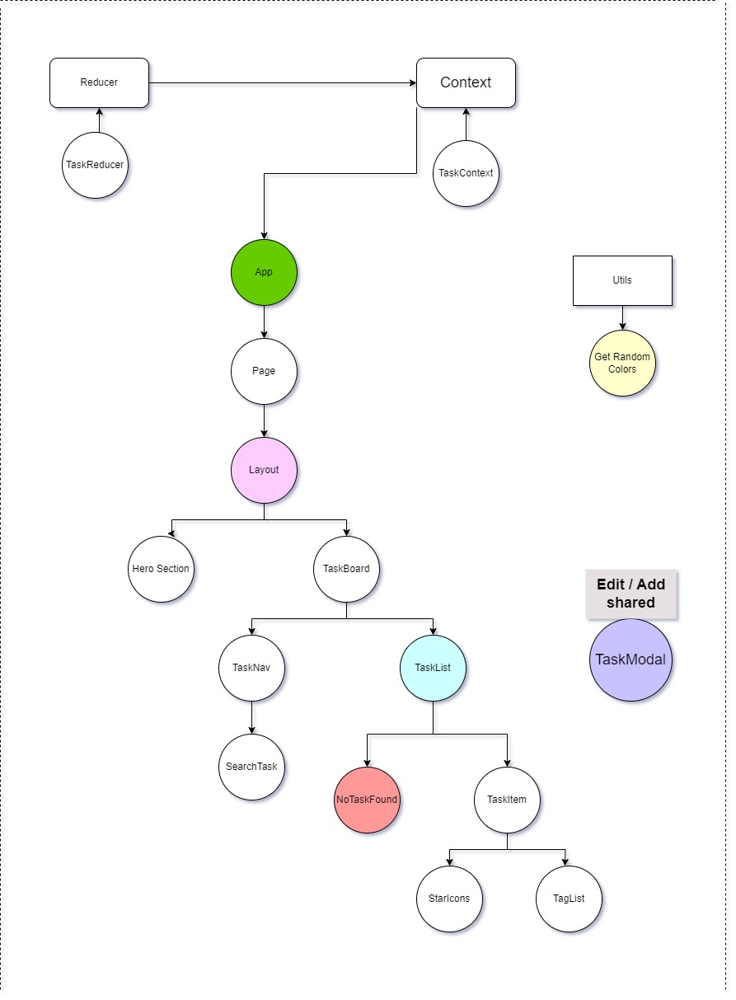

# Task Improver - 3rd Assignment

## Description

This is a React project focused on task management with several features:

- [x] Search tasks by title
- [x] Delete tasks
- [x] Edit tasks
- [x] Mark tasks as favorite or unfavorite
- [x] Utilizes Context API and useReducer for state management
- [x] Dynamic tags with different colors

## Diagrams

### TaskImprover.drawio Diagram

[](diagrams/TaskImprover.drawio)

The [TaskImprover.drawio](diagrams/TaskImprover.drawio) file provides an interactive diagram illustrating the project's architecture and component relationships. Open this file with draw.io for a detailed view.

## Project Repository

Visit the project repository: [Improved-Tasker](https://github.com/Tanzimhossain222/Improved-Tasker)

## Project Setup

1. Clone the repository:

```bash
git clone https://github.com/Tanzimhossain222/Improved-Tasker.git
cd Improved-Tasker
```

2. Install dependencies using Yarn:

```bash
yarn install
```

3. Start the development server:

```bash
yarn start
```

## Contributing

Feel free to contribute to this project by opening issues or submitting pull requests.

## License

This project is licensed under the [MIT License](LICENSE).
